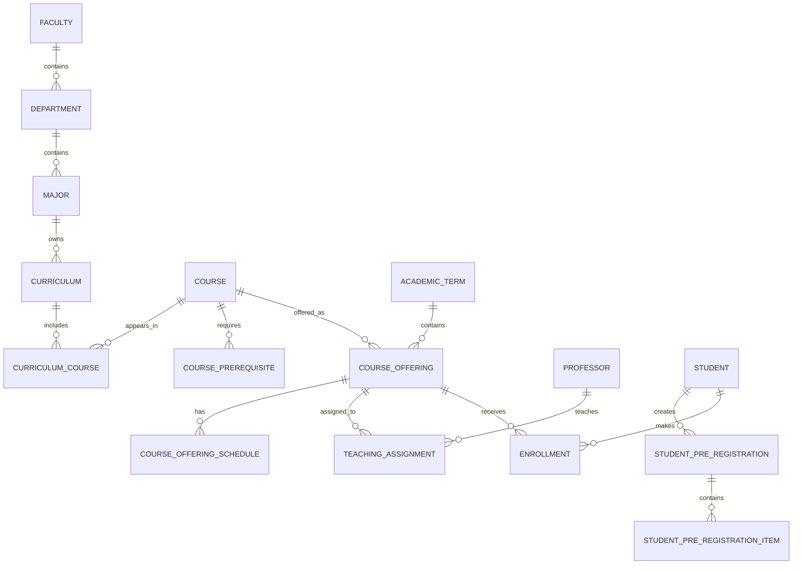

# University Pre-Registration System

An academic planning backend for collecting student course demand, professor teaching requests, and education-office decisions before a semester begins. The system turns those three inputs into scheduled course offerings, publishes the result to students, and supports final enrollment.

The project is designed as a clear university project: the business flow is easy to demonstrate, the responsibilities are separated by layer, and every role follows a predictable workflow.

## What the system solves

Before registration opens, a university needs three pieces of information:

1. Which courses students need.
2. Which courses professors can teach and when they are available.
3. Which classes the education office will actually offer, with a professor, capacity, and final schedule.

The system collects this information in order and keeps **pre-registration** separate from **final enrollment**:

```text
Student demand
      + Professor teaching requests
                ↓
        Education planning
                ↓
 Course offering + professor + schedule + capacity
                ↓
        Student result and enrollment
```

## Main roles

| Role | Responsibility |
| --- | --- |
| `Student` | Select eligible courses, submit pre-registration, review offered classes, and enroll. |
| `Professor` | Select permitted courses, set priorities, submit availability, and send a teaching request. |
| `EducationAdmin` | Manage curricula, review demand, create offerings, assign professors, set schedules, publish classes, and inspect reports. |

## Feature set

### Authentication and access control

- JWT access-token authentication.
- Role-based authorization for students, professors, and education administrators.
- Current-user resolution from the authenticated token; clients do not submit another user's ID to perform personal operations.
- PBKDF2-SHA256 password hashing with a random salt and 100,000 iterations.
- Configurable token issuer, audience, secret, and expiration time.
- Centralized handling for unauthorized, forbidden, not-found, business-rule, and unexpected errors.
- API errors are returned as `ProblemDetails` with user-friendly Persian messages for the Persian UI.

### Student workflow

- View active academic terms and the student's current profile and major.
- Load courses from the student's active curriculum.
- Respect the relationship between department, major, and specialization curriculum.
- Exclude inactive courses, passed courses, and courses whose prerequisites have not been completed.
- Save a priority-ordered draft without reserving a seat.
- Submit a pre-registration after the final eligibility check.
- Allow up to two pre-registration attempts per student and academic term.
- Preserve previous selections when the second attempt is opened for editing.
- View the result for every requested course: offered/not offered, professor, schedule, and remaining capacity.
- Enroll in a finalized offering only when the course is still eligible, the offering has capacity, and the student's existing timetable has no conflict.
- View confirmed enrollments for the selected term.

### Professor workflow

- View only the courses assigned to the professor by education.
- Select courses and set teaching priorities.
- Add availability slots per course with day, start time, and end time.
- Reject invalid days, reversed times, duplicate slots, and overlapping availability ranges.
- Save a draft teaching request.
- Submit the request after every selected course has at least one suggested time.
- Reopen a submitted request before education assigns a course, then edit it again.
- View the final schedule after education publishes an offering.

### Education administration workflow

- Browse departments, majors, curricula, courses, professors, terms, demand, teaching requests, and planning summaries.
- Create and maintain a curriculum for each major or specialization.
- Add an existing course to a curriculum without changing other majors' curricula.
- Create a new course directly inside a curriculum.
- Generate the next course code using the `CE-###` pattern and show it as read-only before creation.
- Set recommended semester and required/elective status for each curriculum course.
- Create one course offering per course and academic term.
- Set capacity and active/inactive state.
- Assign one or more qualified professors to an offering.
- Save the final weekly schedule for an offering.
- Detect professor conflicts with other active offerings in the same term.
- Ensure a final class fits the professor's submitted availability for that course.
- Finalize and publish an offering, or reopen it for planning when no enrollment prevents reopening.
- Review course demand, professor requests, offering status, capacity, enrollment count, and remaining capacity.

## Academic rules enforced by the backend

- Only active terms, courses, curricula, and offerings can participate in the live workflow.
- A student sees courses from the correct active curriculum for the student's major; courses from another specialization are not mixed into the list.
- A course is eligible only when its prerequisites are satisfied and it has not already been passed.
- A submitted pre-registration must contain at least one eligible course.
- Duplicate courses and invalid priorities are rejected.
- A student can start at most two pre-registration attempts for a term.
- A professor can request only courses that education has assigned to that professor.
- Each selected professor course must have a suggested availability before final submission.
- An offering cannot be finalized without an active course, active term, positive capacity, assigned professor, and schedule.
- Capacity cannot be reduced below the current active enrollment count.
- An offering cannot be duplicated for the same course and term.
- A student cannot enroll twice in the same course or offering.
- A student cannot enroll in a full offering or in a timetable-conflicting offering.
- Schedule slots in one offering cannot be duplicated or overlap on the same day.

## Architecture

The backend follows Clean Architecture with feature-oriented application code.

```text
UniversitySystem.Api
        ↓
UniversitySystem.Application
        ↓
UniversitySystem.Domain

UniversitySystem.Persistence  → EF Core, SQL Server, repositories, migrations
UniversitySystem.Infrastructure → JWT, hashing, current user, clock
```

### Layer responsibilities

| Project | Responsibility |
| --- | --- |
| `UniversitySystem.Domain` | Entities, enums, shared base classes, and domain state. It has no HTTP or EF Core dependency. |
| `UniversitySystem.Application` | Use cases, commands, queries, handlers, DTOs, business services, business logic, and repository contracts. |
| `UniversitySystem.Persistence` | `DbContext`, EF Core mappings, SQL Server access, repository implementations, and versioned migrations. |
| `UniversitySystem.Infrastructure` | JWT generation, password hashing, current-user access, and technical services such as date/time. |
| `UniversitySystem.Api` | HTTP controllers, request contracts, Scalar/OpenAPI, CORS, health checks, and the global exception handler. |
| `tests` | Unit tests and integration tests using isolated in-memory/SQLite infrastructure. |

### Patterns and engineering practices

- **Clean Architecture:** business rules do not depend on controllers or database details.
- **SOLID:** controllers handle HTTP, services coordinate use cases, repositories handle persistence, and domain logic handles state transitions.
- **CQRS style:** commands change state and queries read state.
- **MediatR:** controllers send requests to handlers instead of containing business logic.
- **Repository pattern:** application code depends on small feature-specific repository interfaces.
- **Unit of Work:** related changes are saved through a single application boundary.
- **Pipeline behaviors:** logging and performance measurement run around MediatR requests.
- **DTOs:** API contracts are separated from database entities.
- **Centralized errors:** `GlobalExceptionHandler` maps application exceptions to consistent `ProblemDetails` responses.
- **EF Core LINQ:** normal queries use EF Core; join queries use query syntax with `from ... in _context.Table` as required by the project convention.

## Core domain model



The most important distinction is:

| Concept | Meaning |
| --- | --- |
| `Course` | Stable catalog definition, such as Database, 3 credits. |
| `CurriculumCourse` | The course's place in one major curriculum, including recommended term and required status. |
| `CourseOffering` | A specific run of a course in one academic term with capacity. |
| `StudentPreRegistration` | A student's demand and priority list; it does not reserve a seat. |
| `Enrollment` | A confirmed registration in a specific offering. |
| `ProfessorTeachingRequest` | A professor's interest and availability; it is not the final assignment. |
| `TeachingAssignment` | Education's final professor-to-offering assignment. |

## API surface

All routes use the `/api/v1` prefix. The complete request and response schemas are available in Scalar.

### Authentication and current user

```http
POST /api/v1/auth/login
GET  /api/v1/auth/me
```

Example login body:

```json
{
  "username": "student-number-or-phone",
  "password": "your-password"
}
```

Use the returned `accessToken` as a Bearer token for protected endpoints.

### Student endpoints

```http
GET  /api/v1/student/pre-registration/eligible-courses?academicTermId={termId}
GET  /api/v1/student/pre-registration/{academicTermId}
PUT  /api/v1/student/pre-registration/{academicTermId}
POST /api/v1/student/pre-registration/{academicTermId}/submit
POST /api/v1/student/pre-registration/{academicTermId}/new-attempt
GET  /api/v1/student/pre-registration/{academicTermId}/result
GET  /api/v1/student/enrollments?academicTermId={termId}
POST /api/v1/student/enrollments
```

### Professor endpoints

```http
GET  /api/v1/professor/teaching-request/{academicTermId}
PUT  /api/v1/professor/teaching-request/{academicTermId}
PUT  /api/v1/professor/teaching-request/{academicTermId}/availability
POST /api/v1/professor/teaching-request/{academicTermId}/submit
POST /api/v1/professor/teaching-request/{academicTermId}/reopen
GET  /api/v1/professor/teaching-request/eligible-courses?academicTermId={termId}
GET  /api/v1/professor/teaching-request/final-schedule?academicTermId={termId}
```

### Education administration endpoints

```http
GET    /api/v1/admin/majors
GET    /api/v1/admin/majors/{majorId}/curriculum
GET    /api/v1/admin/majors/{majorId}/courses/next-code
PUT    /api/v1/admin/majors/{majorId}/curriculum
POST   /api/v1/admin/majors/{majorId}/courses

GET    /api/v1/admin/pre-registration/demand?academicTermId={termId}
GET    /api/v1/admin/teaching-requests?academicTermId={termId}
GET    /api/v1/admin/planning/overview?academicTermId={termId}

GET    /api/v1/admin/course-offerings?academicTermId={termId}
POST   /api/v1/admin/course-offerings
PUT    /api/v1/admin/course-offerings/{id}
GET    /api/v1/admin/course-offerings/{id}/professors
POST   /api/v1/admin/course-offerings/{id}/professors
DELETE /api/v1/admin/course-offerings/{id}/professors/{professorId}
GET    /api/v1/admin/course-offerings/{id}/schedule
PUT    /api/v1/admin/course-offerings/{id}/schedule
POST   /api/v1/admin/course-offerings/{id}/finalize
POST   /api/v1/admin/course-offerings/{id}/reopen

GET    /api/v1/admin/reports?academicTermId={termId}
```

### Shared lookup endpoints

```http
GET /api/v1/lookups/academic-terms
GET /api/v1/lookups/courses
GET /api/v1/lookups/courses/catalog
GET /api/v1/lookups/professors
```

## Technology stack

- .NET 10 / ASP.NET Core Web API
- C# with nullable reference types and implicit usings
- Entity Framework Core 10
- SQL Server for the application database
- SQLite and EF Core InMemory for isolated tests
- MediatR for application request dispatching
- Mapster for request/DTO mapping
- JWT Bearer authentication
- PBKDF2-SHA256 password hashing
- Scalar and OpenAPI for interactive API documentation
- Swashbuckle annotations for endpoint metadata
- xUnit, ASP.NET Core `WebApplicationFactory`, and Coverlet collector for tests
- React/TypeScript frontend maintained as a companion project outside this backend repository

## Project structure

```text
UniversitySystem.sln
├── src
│   ├── UniversitySystem.Domain
│   ├── UniversitySystem.Application
│   │   ├── Common
│   │   └── Features
│   ├── UniversitySystem.Infrastructure
│   ├── UniversitySystem.Persistence
│   │   ├── Configurations
│   │   ├── Migrations
│   │   └── Repositories
│   └── UniversitySystem.Api
│       ├── Contracts
│       ├── Controllers
│       ├── Infrastructure
│       └── Serialization
├── tests
│   ├── UniversitySystem.UnitTests
│   └── UniversitySystem.IntegrationTests
├── docs
└── README.md
```

Feature folders in `UniversitySystem.Application` include `Auth`, `StudentPreRegistration`, `ProfessorTeachingRequests`, `AcademicWorkflow`, `CourseOfferings`, `TeachingAssignments`, `StudentResults`, `Enrollments`, `MajorCurricula`, `AdminPlanning`, `AdminReports`, and `UiSupport`.

## Getting started

### Requirements

- .NET SDK 10.0 or later.
- SQL Server for a live run.
- A database configured through `ConnectionStrings:DefaultConnection`.
- Windows, macOS, or Linux with the normal .NET tooling.

### Restore, build, and test

```bash
dotnet restore
dotnet build
dotnet test
```

Unit and integration tests use isolated providers and do not require the development SQL Server database.

### Configure the API

The application reads these settings:

```text
ConnectionStrings:DefaultConnection
Jwt:SecretKey
Jwt:Issuer
Jwt:Audience
Jwt:ExpirationMinutes
```

For a local run, use `appsettings.Development.json`, environment variables, or another local configuration source. Never commit real database passwords or production JWT secrets.

Example environment-variable names:

```text
ConnectionStrings__DefaultConnection=Data Source=localhost;Initial Catalog=UniversitySystem;Integrated Security=True;Trust Server Certificate=True
Jwt__SecretKey=replace-with-a-long-development-secret
Jwt__Issuer=UniversitySystem
Jwt__Audience=UniversitySystem
Jwt__ExpirationMinutes=60
```

The application expects the database schema to be managed deliberately. It does not automatically apply migrations when the API starts.

### Run the API

```bash
dotnet run --project src/UniversitySystem.Api --launch-profile https
```

With the included launch profiles, the usual development addresses are:

- Scalar: `https://localhost:7146/scalar/v1`
- HTTP fallback: `http://localhost:5014`
- Health check: `https://localhost:7146/health`

If a port is already in use, stop the previous API process or start the project with another local profile/port.

## Demonstration flow

The shortest end-to-end presentation is:

1. Log in as `EducationAdmin` and confirm the academic term and major curricula.
2. Open a major curriculum, add an existing course, or create a new `CE-###` course.
3. Log in as a `Student`, review courses filtered by the student's major and curriculum, save priorities, and submit pre-registration.
4. Log in as a `Professor`, select permitted courses, add availability, and submit the teaching request.
5. Return to `EducationAdmin`, inspect student demand and professor requests, create an offering, assign the professor, enter the final schedule, and publish it.
6. Return to the student account, open the result, verify capacity and timetable, and enroll in the finalized offering.
7. Show the reports page to explain demand, offering status, professor count, enrollment, and remaining capacity.

## Testing strategy

- **Unit tests:** validate domain/application rules without a real database by using EF Core InMemory where appropriate.
- **Integration tests:** exercise HTTP endpoints through `WebApplicationFactory` with an isolated SQLite database.
- **Workflow coverage:** authentication, role access, curriculum-based eligibility, prerequisite filtering, pre-registration drafts and submissions, teaching requests, availability, offering management, scheduling, publication, and enrollment.
- **Safety checks:** duplicate selections, inactive entities, capacity limits, invalid transitions, professor conflicts, student timetable conflicts, and the two-attempt pre-registration limit.

Run the complete suite with:

```bash
dotnet test UniversitySystem.sln
```

## Documentation map

- [`docs/PROJECT_GUIDE.fa.md`](docs/PROJECT_GUIDE.fa.md) — Persian presentation guide and business process explanation.
- [`docs/CODE_MAP.fa.md`](docs/CODE_MAP.fa.md) — responsibility map for features, services, repositories, entities, and controllers.
- [`docs/UI_API.fa.md`](docs/UI_API.fa.md) — frontend contract, expected payloads, and UI integration notes.
- [`docs/ACADEMIC_PROCESS.fa.md`](docs/ACADEMIC_PROCESS.fa.md) — academic workflow details.
- [`docs/CLEANUP.fa.md`](docs/CLEANUP.fa.md) — cleanup and architecture notes.

## Current scope

This repository implements the core academic planning and enrollment workflow needed for a university demonstration. The following items are intentionally outside the current scope: automatic timetable optimization, room allocation, room-conflict detection, full student grading/transcript APIs, password recovery, refresh-token revocation, complete master-data CRUD, and production deployment automation.

Those boundaries keep the project explainable while leaving clear extension points for a future production version.

## Security and deployment notes

- Use HTTPS outside local development.
- Replace the development JWT secret before deployment.
- Store connection strings and credentials outside source control.
- Use a dedicated database login with the minimum required permissions.
- Review and apply migrations as a controlled deployment step.
- Keep Scalar/OpenAPI exposure limited to development or an authenticated internal environment.

## License

No license has been declared for this academic project yet. Add the appropriate license before distributing the repository publicly.
